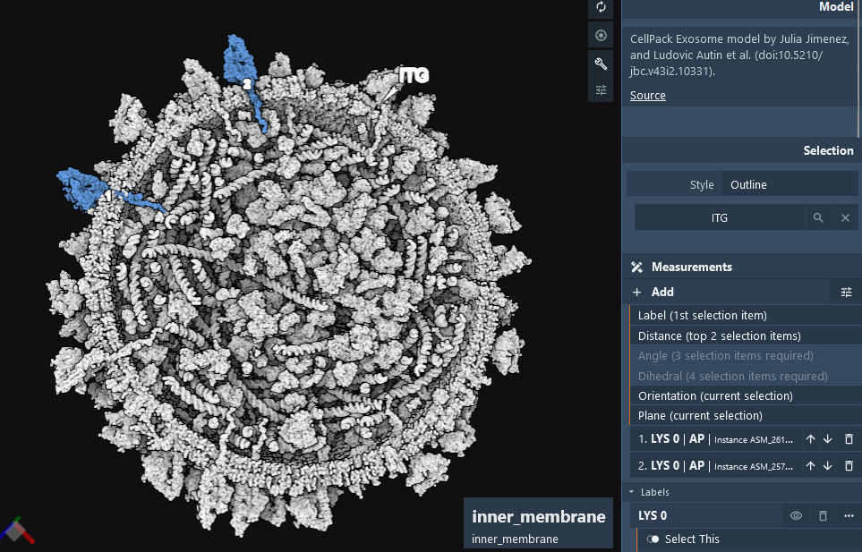
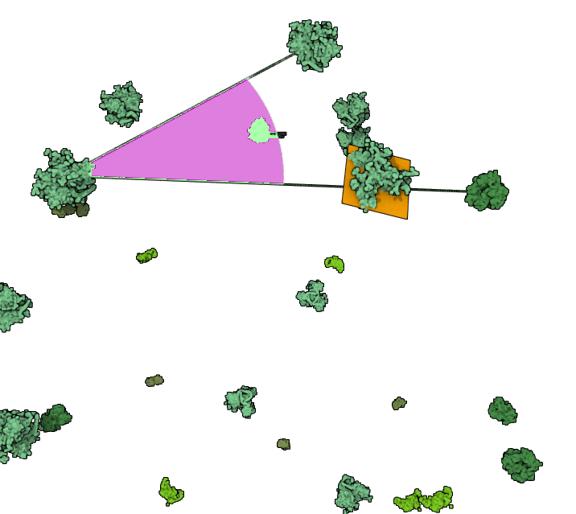

#### Measurements Overview

Some tips & examples for doing measurements in #molstar at [Mol* Mesoscale Explorer](https://mesoscope.scripps.edu/explorer):

- Label, distance, angle, dihedral
- Orientation (box/axes from principal components)
- Plane (best fit)

#### Basic Measurements

View: [https://mesoscope.scripps.edu/explorer/?url=mesoscope.scripps.edu/explorer/docs/tips/measurements/measurements.molx&type=molx](https://mesoscope.scripps.edu/explorer/?url=mesoscope.scripps.edu/explorer/docs/tips/measurements/measurements.molx&type=molx)

#### Label Option
*Overview*

This panel allows users to configure text overlay settings for visual elements. It provides options for adjusting text properties, visibility, and styling.

*Options*  
- **Select This**: Toggle to activate and configure the settings for the current selection. 
- **Opacity**: Adjust the opacity level of the text, with a range from fully transparent (0) to fully opaque (1). 
- **Quality**: Select the rendering quality of the text; options include 'Auto' for automatic adjustment based on display parameters. 
- **Text**: Field to enter the text content to be displayed. Note: if the label is a protein name, hovering over the label will highlight all instances of that protein in the viewport. 
- **Text Color**: Choose the color for the text. 
- **Text Size**: Slider to adjust the size of the text. 
- **Snapshot Key**: Assign a unique key for interactive behavior; clicking the label will load the snapshot with the corresponding key. 
- **Tooltip**: Enter a brief description or guidance that appears when users hover over the text element. 
*Advanced Options*  
- **Material Presets**: Apply predefined material properties to the text for consistent styling. 
- **Clip**: Enable or disable clipping of the text to its bounding box. 
- **Instance Granularity**: Control whether text properties are applied on a per-instance basis. 
- **Font Family**: Choose from various font families such as Sans Serif for text rendering. 
- **Font Quality**: Select the quality of the font rendering, such as 'high' for better clarity. 
- **Font Style and Variant**: Adjust the style and variant of the font, including options like Normal or Italic. 
- **Font Weight**: Set the weight of the font from light to bold. 
- **Size Factor**: Scale the text size relative to its original dimensions. 
- **Border Width and Color**: Customize the border around the text for visibility and aesthetics. 
- **Offset X, Y, Z**: Fine-tune the position of the text overlay in three-dimensional space. 
- **Background**: Enable a background layer for the text for enhanced readability. 
- **Background Opacity**: Adjust the opacity of the background. 
- **Tether**: Enable a line tethering the text to a specific point in the UI. 
- **Tether Length and Base Width**: Configure the appearance and dimensions of the tether. 
- **Attachment Point**: Set the attachment point for the text within its container, such as 'middle-center'. 
- **Scale By Radius**: Option to scale the text size dynamically based on the radius of the bounding sphere. 
*Visualization* 
- **Visuals**: Manage related visual elements. 
- **Culling & LOD**: Configure the level of detail and culling options to optimize performance. 
*Usage* 
This panel is crucial for users needing precise control over text displays in their projects, allowing for detailed customization and styling to suit various use cases. The intuitive layout ensures that both novice and advanced users can efficiently apply and modify text settings.

 
